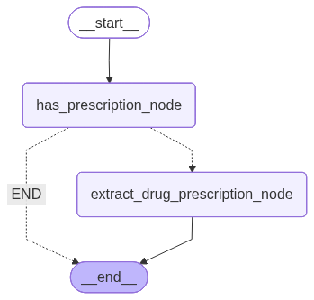

# Medical Transcript AI Agent (LangGraph)

This repository demonstrates a production-oriented AI system for analyzing doctor–patient conversations using LangChain and LangGraph.

The system processes raw medical transcripts, determines whether a drug prescription is present, extracts structured prescription data using LLM-powered tools, validates the safety of the transcription, and returns auditable results. The architecture emphasizes clear separation between agents and tools to improve reliability, safety, and maintainability.

---

## Overview

The project is designed around a graph-based execution model where:

- A routing agent controls decision-making and flow
- LLM-powered tools perform constrained, single-purpose transformations
- Safety validation is isolated and explainable
- Outputs are structured and suitable for downstream systems

This approach avoids the common anti-pattern of using a single autonomous agent for all tasks.

---

## Graph Architecture



---

## Running the Project

### Prerequisites

- Python 3.13+
- [`uv`](https://docs.astral.sh/uv/) installed. To install it:

```bash
pip install uv
```

- Dependencies installed from `pyproject.toml`:

```bash
uv sync
```

- An OpenAI API key in a `.env` file at the project root:

```env
OPENAI_APIKEY=sk-...
```

---

### 1. Start the Vector Database (Weaviate + Ollama)

The RAG layer depends on Weaviate (with Ollama for embeddings). Start the stack with Docker Compose:

```bash
cd rag
docker compose up -d
```

This will spin up:

- **Weaviate** on `http://localhost:8080` — vector database
- **Ollama** on `http://localhost:11434` — local LLM for embeddings (`text2vec-ollama`)

Wait for both services to be healthy before proceeding.

---

### 2. Run the Agent

```bash
uv run agent/langchain_agent.py
```

---

## Example

### Input

The agent is invoked by passing a `PrescriptionGraphState` with a `transcript` field into the compiled LangGraph chain:

```python
state = await chain.ainvoke(
    PrescriptionGraphState(
        transcript="Doctor: I'm prescribing amoxicillin 4000mg. "
                   "Patient: How often should I take it? "
                   "Doctor: Three times daily for 7 days."
    )
)
```

### Output

```text
Has prescription: has_prescription=True has_prescription_confidence=0.99

Extracted: prescriptions=[
  ExtractedPrescription(
    drug_name='amoxicillin',
    dosage_value=4000.0,
    dosage_unit='mg',
    frequency='Three times daily',
    duration='7 days',
    route=None,
    form=None,
    instructions=None,
    confidence=0.95
  )
]
missing_fields=['route', 'form', 'instructions']
extraction_confidence=0.95
```

### State Schema

`PrescriptionGraphState` is the shared state passed between all nodes in the graph:

```python
class PrescriptionGraphState(BaseModel):
    llm_calls: int = 0                                              # tracks number of LLM calls made
    transcript: Optional[str] = None                               # raw doctor-patient conversation
    has_prescription_output: Optional[HasPrescriptionModel] = None # routing decision
    extracted_prescriptions: Optional[ListPrescriptionExtractionModel] = None  # structured result
    summary: Optional[str] = None                                  # conversation summary (no-prescription path)
```
